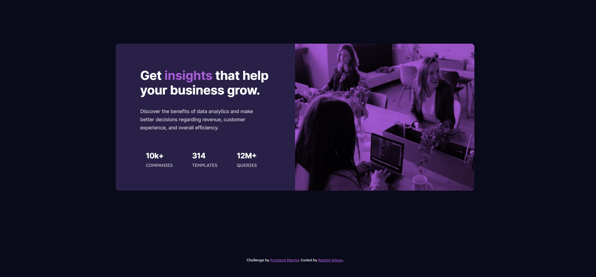

# Frontend Mentor - Stats preview card component solution

This is a solution to the [Stats preview card component challenge on Frontend Mentor](https://www.frontendmentor.io/challenges/stats-preview-card-component-8JqbgoU62). Frontend Mentor challenges help you improve your coding skills by building realistic projects. 

## Table of contents

- [Overview](#overview)
  - [The challenge](#the-challenge)
  - [Screenshot](#screenshot)
  - [Links](#links)
- [My process](#my-process)
  - [Built with](#built-with)
  - [What I learned](#what-i-learned)
  - [Continued development](#continued-development)
  - [Useful resources](#useful-resources)
- [Author](#author)
- [Acknowledgments](#acknowledgments)

## Overview

### The challenge

Users should be able to:

- View the optimal layout depending on their device's screen size

### Screenshot

### Links

- Solution URL: [Hosted By Github Pages](https://shangum.github.io/Stats-Preview-Card-Component-Frontend-Mentor/)

## My process

### Built with

- HTML
- CSS custom properties
- Flexbox
- CSS Grid
- Mobile-first workflow

### What I learned

During this project I started getting familiar with the "Mobile-first" workflow. Normally I start with the desktop layout and move on to the mobile and tablet designs as afterthoughts. The order of design was Mobile, Desktop, and finally for a tablet with a screen size of 768px. I added the tablet design just as a bonus. I also began to use responsive units in the project but I converted the units at the end after the design was pretty much set. I also got to work with the "mix-blend-mode" css rule in order to give a color hue to the main image.

### Continued development

In future projects I aim to approach the following way
  1) Use responsive units (ems etc) from the beginning.
  2) Design the layout in the following order: Mobile, Tablet, Normal/Large screens.
  3) Improve the Design so that more of the in between screen sizes still display a solid design. For this project I targeted three screen sizes. 1440px, 376px to 768px, and 375px.
  4) Get more precise with mix-blend-mode(s) and rely less on trial and error.

### Useful resources

- [Media queries with multiple screen size constraints](https://www.peachpit.com/articles/article.aspx?p=1604236&seqNum=2) - Used this site as a reference in order to create media queries where the screen size fell between two specified screen values.
- [Overlay a div on top of another](https://www.w3schools.com/howto/howto_css_overlay.asp) - Did not end up using this technique in the final solution but looked into this as a possible way to overlay a light colored low opacity div on top of the main image in order to lighten the hue a tad. I left the rule in the style sheet ".overlay".
- [Reference For CSS Units] (https://www.w3schools.com/cssref/css_units.asp) - CSS Units reference sheet
- [CSS Unit Calculator] (https://www.w3schools.com/tags/ref_pxtoemconversion.asp) - Used this ex post facto in order to convert my pixelated css rules to em.

## Author

- Website - [Rashid Wilson](#)
- Frontend Mentor - [@Shangum](https://www.frontendmentor.io/profile/shangum)

## Acknowledgments

Shout out to @FluffyKas who recommended I move to responsive units when designing pages ( Otherwise I'd likely still be using pixels 10 years from now).

